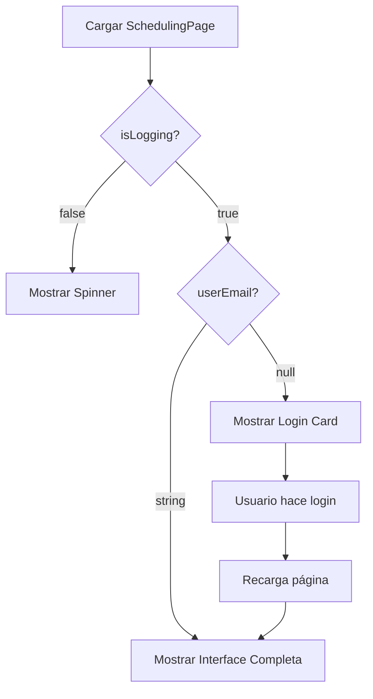

# Authentication Gate for Scheduling - Documentación

## Descripción General

Sistema de autenticación requerida para el proceso de agendamiento de sesiones. Los usuarios anónimos pueden ver información del plan pero deben autenticarse antes de acceder a la funcionalidad de agendamiento.

## Estados de Usuario

### 🔍 **Verificando Autenticación** (`isLogging = false`)
- **Estado**: Cargando información de sesión
- **Vista**: Spinner de carga con mensaje "Verificando autenticación..."
- **Duración**: Breve, mientras NextAuth verifica la sesión

### 👤 **Usuario Anónimo** (`userEmail = null`)
- **Estado**: No autenticado
- **Vista**: 
  - ✅ `SchedulingPlan` - Información del plan visible
  - 🚫 `Sessions` - Oculto
  - 🚫 `SchedulingRules` - Oculto
  - ✅ `LoginGoogle` - Card de login prominente

### ✅ **Usuario Autenticado** (`userEmail = string`)
- **Estado**: Sesión activa con email verificado
- **Vista**: 
  - ✅ `SchedulingPlan` - Información del plan
  - ✅ `Sessions` - Funcionalidad completa de agendamiento
  - ✅ `SchedulingRules` - Reglas y términos

## Implementación

### Componentes Integrados

#### 1. **useIdentifyUser Hook**
```javascript
const { userEmail, isLogging } = useIdentifyUser()

// userEmail: null | string (email del usuario)
// isLogging: boolean (estado de verificación)
```

#### 2. **LoginGoogle Component**
```jsx
<LoginGoogle 
    text="Continuar con Google" 
    locationBtn="scheduling-page"
/>
```

#### 3. **Conditional Rendering**
```jsx
{isLogging === false ? (
    // Estado de carga
    <LoadingSpinner />
) : userEmail ? (
    // Usuario autenticado
    <FullSchedulingInterface />
) : (
    // Usuario anónimo
    <LoginRequired />
)}
```

### Flujo de Estados



## Card de Login

### Diseño y Contenido

#### Header
- **Título**: "Inicia sesión para continuar"
- **Descripción**: Explicación clara de por qué necesita registrarse

#### Beneficios Section
```
Al registrarte podrás:
✅ Agendar tus sesiones de asesoría personalizada
✅ Gestionar y modificar tus citas
✅ Acceder a tu historial de sesiones
✅ Recibir recordatorios y notificaciones
```

#### Call to Action
- **Botón**: LoginGoogle component
- **Texto**: "Continuar con Google"
- **Tracking**: `locationBtn="scheduling-page"`

### Características Visuales

#### Diseño
- **Layout**: Card centrada con sombra sutil
- **Colores**: Azul corporativo con fondo claro
- **Responsive**: Se adapta a móvil y desktop

#### Elementos de UI
- **Border izquierdo**: Acento azul en sección de beneficios
- **Iconografía**: Checkmarks para lista de beneficios
- **Spacing**: Generoso para legibilidad

## Experiencia de Usuario

### Flujo de Navegación

#### Usuario Anónimo
1. **Llega a página de agendamiento**
2. **Ve información del plan** (motivación)
3. **Encuentra card de login** (claro call-to-action)
4. **Lee beneficios** (convencimiento)
5. **Hace clic en login** (conversión)
6. **Se autentica con Google** (facilidad)
7. **Regresa con funcionalidad completa** (recompensa)

#### Usuario Autenticado
1. **Llega a página de agendamiento**
2. **Ve funcionalidad completa inmediatamente**
3. **Puede empezar proceso de agendamiento**

### Ventajas del Approach

#### 🎯 **Conversión Optimizada**
- **Motivación primera**: Usuario ve el plan antes del login
- **Beneficios claros**: Lista específica de ventajas
- **Fricción mínima**: Login con Google en un clic

#### 🔒 **Seguridad**
- **Datos protegidos**: Solo usuarios autenticados pueden agendar
- **Trazabilidad**: Todas las reservas vinculadas a usuarios reales
- **Integridad**: Previene reservas fantasma o spam

#### 📱 **UX Consistency**
- **Estados claros**: Loading, anónimo, autenticado
- **Transiciones suaves**: Sin cambios abruptos de interface
- **Feedback visual**: Usuario siempre sabe su estado

## Integración con Sistema Existente

### Hooks Utilizados

#### useIdentifyUser
- **Funcionalidad**: Detecta estado de autenticación
- **Retorna**: `{ userEmail, isLogging, anonimousUserID }`
- **Side Effects**: Actualiza datos de usuario anónimo tras login

#### usePreScheduledSessionsStore
- **Funcionalidad**: Gestión de sesiones pre-agendadas
- **Condición**: Solo disponible para usuarios autenticados
- **Persistencia**: Data vinculada al usuario autenticado

### Componentes Reutilizados

#### LoginGoogle
- **Props**: `text`, `locationBtn`
- **Tracking**: Google Tag Manager integration
- **Styling**: Consistente con design system

#### SchedulingPlan
- **Visibility**: Siempre visible (motivación)
- **Content**: Información del plan seleccionado
- **Purpose**: Contexto para decisión de login

## Métricas y Analytics

### Eventos a Trackear

#### Conversion Funnel
```javascript
// Vista de página sin autenticación
gtag('event', 'page_view', {
  authenticated: false,
  page_location: 'scheduling-page'
})

// Intento de login desde scheduling
gtag('event', 'login_attempt', {
  method: 'google',
  source: 'scheduling-page'
})

// Login exitoso
gtag('event', 'login_success', {
  method: 'google',
  source: 'scheduling-page'
})
```

#### User Journey
- Tiempo en página antes de login
- Tasa de conversión anónimo → autenticado
- Abandono en card de login
- Completación de agendamiento post-login

### KPIs Sugeridos
- **Conversion Rate**: % usuarios que se autentican
- **Time to Login**: Tiempo promedio hasta autenticación
- **Bounce Rate**: % que abandona sin autenticarse
- **Completion Rate**: % que completa agendamiento tras login

## Beneficios del Sistema

### Para el Usuario
- **Claridad**: Sabe exactamente qué necesita hacer
- **Motivación**: Ve el valor antes de comprometerse
- **Facilidad**: Login simple con Google
- **Seguridad**: Sus datos están protegidos

### Para el Negocio
- **Calidad de datos**: Solo usuarios reales en sistema
- **Engagement**: Usuarios comprometidos con el proceso
- **Trazabilidad**: Todas las acciones son auditables
- **Reducción de spam**: Barrera natural contra bots

### Para el Sistema
- **Integridad**: Datos consistentes y válidos
- **Performance**: Menos carga para usuarios anónimos
- **Mantenibilidad**: Lógica clara de autorización
- **Escalabilidad**: Base sólida para futuras features

## Consideraciones Técnicas

### Manejo de Estados
- **Loading State**: Evita flashing de contenido
- **Error Handling**: Fallback si falla autenticación
- **Persistence**: Mantiene contexto tras login

### Performance
- **Lazy Loading**: Componentes de agendamiento solo si autenticado
- **Code Splitting**: Optimización automática de bundle
- **Cache Strategy**: Datos de usuario en localStorage

### Accesibilidad
- **Screen Readers**: Labels apropiados
- **Keyboard Navigation**: Tabindex correcto
- **Color Contrast**: Cumple WCAG guidelines
- **Focus Management**: Estados claros de UI

## Próximas Mejoras

### Funcionalidades Futuras
1. **Social Login Adicional**: Facebook, Apple ID
2. **Magic Link**: Login via email sin password
3. **Registration Form**: Opción adicional al social login
4. **Progressive Enhancement**: Funcionalidad limitada sin JS

### Optimizaciones
1. **A/B Testing**: Diferentes textos de conversión
2. **Personalization**: Mensajes basados en fuente de tráfico
3. **Micro-interactions**: Animaciones sutiles
4. **Preloading**: Preparar interface mientras autentica
