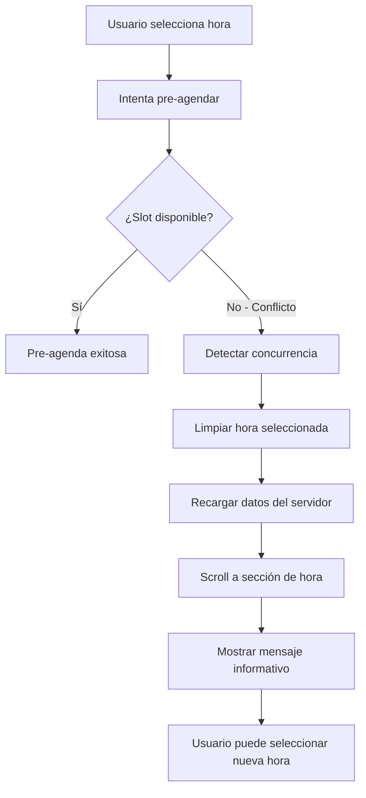

# Auto-Recovery from Concurrency Conflicts - Documentación

## Descripción General

Sistema automático de recuperación cuando un usuario intenta pre-agendar una sesión que ya ha sido reservada por otro usuario en el backend, pero el frontend aún no refleja este cambio. El sistema automáticamente:

1. **Detecta el conflicto** de concurrencia
2. **Vuelve al paso de selección de hora** limpiando solo la hora seleccionada
3. **Recarga la información** de sesiones desde el servidor
4. **Guía al usuario** hacia la nueva selección con scroll automático
5. **Muestra mensaje informativo** explicando qué pasó

## Flujo de Funcionamiento



## Implementación Técnica

### Componentes Modificados

#### 1. `Sessions.jsx`
```javascript
// Pasar función de recarga al hook
const { ... } = useSessionForm({
    planData,
    editingSessionId,
    onEditComplete,
    agendaSlots,
    refreshAgendaSlots: getAgendaSlots // ✅ Nueva funcionalidad
})
```

#### 2. `useSessionForm.js`
```javascript
// Nueva función de manejo de errores
const handleConcurrencyErrorAndRefresh = async (errorInfo) => {
    // Limpiar solo la hora (mantener modalidad y fecha)
    methods.setValue('hour', '')
    methods.setValue('slotId', '')
    
    // Recargar datos del servidor
    if (refreshAgendaSlots) {
        await refreshAgendaSlots()
    }
    
    // Scroll automático
    setTimeout(() => {
        if (hourRef.current) {
            hourRef.current.scrollIntoView({
                behavior: 'smooth',
                block: 'center'
            })
        }
    }, 500)
    
    // Mensaje informativo
    toast.info('Otro usuario reservó ese horario...', { duration: 5000 })
}
```

### Estados del Formulario

#### Antes del Conflicto
```javascript
{
    modality: "presencial",     // ✅ Se mantiene
    date: "2025-09-10",        // ✅ Se mantiene  
    hour: "14:00",             // ❌ Se limpia
    slotId: "slot123"          // ❌ Se limpia
}
```

#### Después del Conflicto
```javascript
{
    modality: "presencial",     // ✅ Mantenido
    date: "2025-09-10",        // ✅ Mantenido
    hour: "",                  // 🔄 Limpiado para nueva selección
    slotId: ""                 // 🔄 Limpiado para nueva selección
}
```

## Experiencia de Usuario

### Escenario Típico

1. **Usuario A** ve horarios disponibles cargados hace 2 minutos
2. **Usuario B** pre-agenda el slot de las 14:00 
3. **Usuario A** intenta seleccionar las 14:00 (conflicto)
4. **Sistema** detecta que el slot ya no está disponible
5. **Auto-recovery** se activa:
   - ❌ NO recarga toda la página
   - ✅ Limpia solo la hora seleccionada
   - ✅ Mantiene modalidad y fecha seleccionadas
   - ✅ Actualiza lista de horarios disponibles
   - ✅ Scroll automático a sección de horas
   - ✅ Mensaje claro de qué pasó

### Mensaje al Usuario
```
"Otro usuario reservó ese horario. Los horarios han sido actualizados. 
Por favor, selecciona una nueva hora."
```

## Beneficios del Sistema

### 🚀 **Experiencia Mejorada**
- **Sin recargas de página**: Mantiene el contexto del usuario
- **Selección preservada**: No pierde modalidad ni fecha seleccionadas
- **Guía visual**: Scroll automático hacia donde debe actuar
- **Feedback claro**: Mensaje específico sobre qué pasó

### ⚡ **Eficiencia**
- **Datos actualizados**: Obtiene estado real del servidor
- **Mínima interrupción**: Solo retrocede al paso necesario
- **Tiempo ahorrado**: No necesita volver a llenar todo el formulario

### 🛡️ **Robustez**
- **Manejo de errores**: Recuperación automática de conflictos
- **Consistencia**: Datos siempre sincronizados con el servidor
- **Prevención**: Evita pre-reservas en slots ya ocupados

## Eventos del Sistema

### Eventos Disparados
```javascript
// Cuando se resuelve un conflicto de concurrencia
window.dispatchEvent(new CustomEvent('concurrencyErrorResolved', {
    detail: {
        timestamp: new Date().toISOString(),
        reason: 'Conflicto de concurrencia resuelto'
    }
}))
```

### Eventos Escuchados
```javascript
// Recarga manual de datos
window.addEventListener('manualRefreshRequested', handleManualRefresh)

// Resolución de conflictos automática
window.addEventListener('concurrencyErrorResolved', handleAutoRecovery)
```

## Casos de Uso Resueltos

### 1. **Múltiples Usuarios Simultáneos**
```
Problema: Varios usuarios ven los mismos horarios disponibles
Solución: Auto-recovery actualiza datos cuando hay conflicto
Resultado: Cada usuario ve disponibilidad real en tiempo real
```

### 2. **Conexión Lenta o Intermitente**
```
Problema: Datos obsoletos por conexión lenta
Solución: Recarga automática cuando se detecta inconsistencia
Resultado: Datos siempre actualizados independiente de la conexión
```

### 3. **Sesiones Largas de Navegación**
```
Problema: Usuario tiene página abierta por mucho tiempo
Solución: Auto-recovery mantiene datos frescos automáticamente
Resultado: No necesita refrescar página manualmente
```

## Métricas y Monitoreo

### Eventos a Trackear
- Frecuencia de conflictos de concurrencia
- Tiempo promedio de recuperación
- Tasa de éxito en re-selección después del conflicto
- Satisfacción del usuario (menos abandonos)

### Logs de Debug
```javascript
console.log('Conflicto de concurrencia detectado:', {
    slotId: attemptedSlotId,
    timestamp: new Date().toISOString(),
    userAction: 'pre-booking attempt',
    resolution: 'auto-recovery activated'
})
```

## Limitaciones y Consideraciones

### Dependencias
- **Función refreshAgendaSlots**: Debe estar disponible en el componente padre
- **Referencias de scroll**: hourRef debe estar correctamente configurado
- **Conectividad**: Requiere conexión para recargar datos

### Fallbacks
- Si `refreshAgendaSlots` no está disponible, solo limpia el formulario
- Si `hourRef` no existe, solo muestra el mensaje sin scroll
- Si la recarga falla, el usuario puede usar el botón manual de recarga

## Próximas Mejoras

### Optimizaciones Futuras
1. **WebSocket Integration**: Actualizaciones en tiempo real sin esperar conflictos
2. **Predicción de Conflictos**: Alertas preventivas cuando un slot está siendo considerado por múltiples usuarios  
3. **Caché Inteligente**: Invalidación automática de datos obsoletos
4. **Feedback Háptico**: Vibración en móviles para indicar conflictos resueltos
