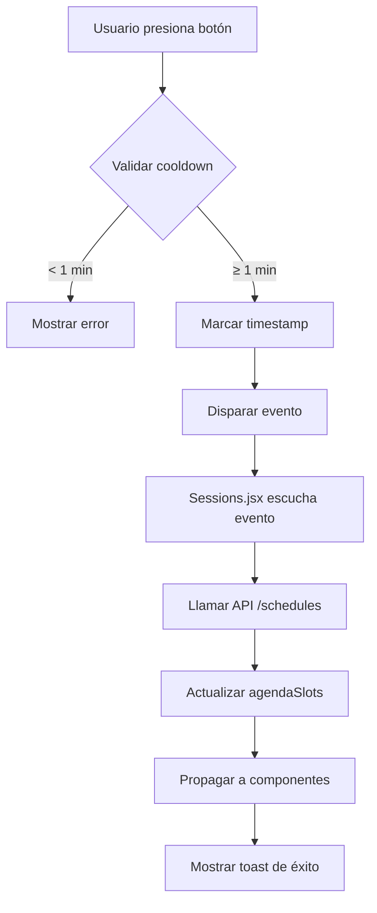

# Manual Refresh Button - Documentación Actualizada

## Descripción General

El botón de recarga manual permite a los usuarios actualizar manualmente el estado de las sesiones pre-agendadas **por otros usuarios** para verificar si han sido confirmadas o canceladas. Esta funcionalidad está integrada en un banner informativo que explica claramente cuándo y por qué usar la recarga manual.

## Características Principales

### 🔄 Recarga Inteligente
- **Actualización de datos**: Obtiene el estado más reciente de los slots desde el servidor
- **Sin recarga de página**: Utiliza eventos personalizados para actualizar solo los datos necesarios
- **Feedback visual**: Muestra estado de carga con spinner animado

### ⏱️ Limitación de Uso
- **Cooldown de 1 minuto**: Solo permite una recarga por minuto por usuario
- **Contador regresivo**: Muestra tiempo restante hasta la próxima recarga permitida
- **Validación en tiempo real**: Se actualiza cada segundo para mostrar el tiempo exacto

### 🎨 Estados Visuales del Banner

#### Banner Activo (con pre-reservas)
- **Color**: Azul suave con bordes azules
- **Contenido**: 
  - "Hay X horarios temporalmente reservados **por otros usuarios**"
  - Explicación de los indicadores ⏱
  - Instrucciones claras sobre cuándo usar el botón de recarga
- **Botón**: Integrado en el lado derecho (desktop) o abajo (móvil)

#### Banner Informativo (sin pre-reservas)
- **Color**: Gris suave con bordes grises
- **Contenido**: 
  - Sugerencia para actualizar si no se ven horarios disponibles
  - Información sobre cancelaciones recientes
- **Botón**: Integrado para verificar disponibilidad actualizada

## Mejoras en UX

### 📝 Mensajes Más Claros
- **Clarificación de "otros usuarios"**: Se especifica que las pre-reservas son de otros usuarios
- **Cuándo usar el botón**: Explicación específica de los casos de uso
- **Feedback contextual**: Diferentes mensajes según el estado actual

### 🎯 Casos de Uso Específicos

1. **Ver Pre-reservas de Otros**: 
   - Banner azul explica que otros usuarios tienen horarios reservados
   - Botón para verificar si han cancelado

2. **No Ver Horarios Disponibles**:
   - Banner gris sugiere que puede haber cancelaciones recientes
   - Botón para actualizar y ver nuevas disponibilidades

3. **Verificar Expiraciones**:
   - Indicadores ⏱ muestran tiempo restante
   - Botón para confirmar si han expirado

## Implementación Técnica

### Componentes Involucrados

1. **PreBookingInfoBanner.jsx**: Banner inteligente con dos estados
2. **ManualRefreshButton.jsx**: Botón compacto integrado
3. **usePreScheduledSessionsStore.js**: Store con lógica de validación
4. **SessionsHour.jsx**: Componente que orquesta la funcionalidad

### Estados del Banner

```javascript
// Estado Activo (con pre-reservas)
hasActivePreBookings: true
totalPreBooked: number > 0
// Muestra banner azul con información detallada

// Estado Informativo (sin pre-reservas)
hasActivePreBookings: false
// Muestra banner gris con sugerencias de uso
```

### Integración del Botón

```jsx
// Banner Activo
<ManualRefreshButton 
  isRefreshing={isRefreshing} 
  compact={true} 
/>

// Props del botón compacto
compact: true // Reduce padding y tamaño de fuente
```

## Textos y Mensajes

### Banner Activo
```
"Hay 1 horario temporalmente reservado por otro usuario"
"Hay X horarios temporalmente reservados por otros usuarios"

"Los horarios marcados con ⏱ se liberarán automáticamente si no se confirman a tiempo"

"💡 ¿Crees que algún horario ya debería estar disponible? 
Usa el botón de actualización para verificar si otros usuarios han cancelado sus pre-reservas"
```

### Banner Informativo
```
"Si no ves horarios disponibles o crees que deberían aparecer más opciones, 
puedes actualizar para verificar cancelaciones recientes"
```

### Tooltip del Botón
```
"Actualizar estado de sesiones reservadas por otros usuarios"
```

## Estilos CSS Actualizados

### Estados del Banner
```css
.prebooking-info-banner.active {
  background: linear-gradient(135deg, #eff6ff, #eef2ff);
  border: 1px solid #bfdbfe;
}

.prebooking-info-banner.inactive {
  background: linear-gradient(135deg, #f9fafb, #f8fafc);
  border: 1px solid #e5e7eb;
}
```

### Botón Compacto
```css
.manual-refresh-btn.compact {
  padding: 6px 10px;
  min-width: 100px;
  font-size: 0.8rem;
  gap: 4px;
}
```

## Responsive Design

### Desktop
- Banner en disposición horizontal
- Botón alineado a la derecha
- Texto completo visible

### Móvil
- Banner en disposición vertical
- Botón alineado a la derecha abajo
- Texto adaptado para pantallas pequeñas

## Casos de Uso Mejorados

### 1. Usuario Ve Pre-reservas de Otros Usuarios
```
Escenario: Usuario ve horarios marcados con ⏱ de otros usuarios
Banner: Azul con explicación clara de que son de "otros usuarios"
Acción: Usuario entiende que puede usar el botón para verificar cancelaciones
Resultado: Datos actualizados muestran estado real
```

### 2. Usuario No Ve Horarios Disponibles
```
Escenario: Usuario no ve opciones disponibles
Banner: Gris con sugerencia de actualizar por cancelaciones recientes
Acción: Usuario usa botón para verificar nuevas disponibilidades
Resultado: Se muestran horarios que pueden haberse liberado
```

### 3. Prevención de Confusión
```
Escenario: Usuario ve pre-reserva y piensa que es suya
Banner: Especifica claramente "por otro usuario"
Resultado: Usuario entiende que no puede tomar ese horario inmediatamente
```

## Métricas de Mejora en UX

### Claridad de Mensajes
- ✅ Especifica que pre-reservas son de "otros usuarios"
- ✅ Explica cuándo y por qué usar el botón
- ✅ Proporciona contexto visual con iconos

### Accesibilidad
- ✅ Tooltips descriptivos
- ✅ Colores contrastantes
- ✅ Texto legible en diferentes tamaños

### Eficiencia
- ✅ Botón siempre visible cuando es útil
- ✅ Feedback inmediato de estado
- ✅ Prevención de uso excesivo

## Próximas Mejoras

### Posibles Adiciones
1. **Notificaciones Push**: Para actualizar automáticamente cuando expiren pre-reservas
2. **Estimación de Liberación**: Mostrar tiempo estimado de liberación
3. **Historial de Actualizaciones**: Mostrar cuándo fue la última actualización exitosa

## Implementación Técnica

### Componentes Involucrados

1. **ManualRefreshButton.jsx**: Componente principal del botón
2. **usePreScheduledSessionsStore.js**: Store con lógica de validación y estado
3. **Sessions.jsx**: Componente padre que maneja la recarga de datos
4. **SessionsHour.jsx**: Componente que muestra el botón y estados visuales

### Flujo de Funcionamiento



### Estados del Store

```javascript
{
  lastManualRefresh: null,        // Timestamp de última recarga
  isManualRefreshing: false,      // Estado de carga
  manualRefresh: async () => {},  // Función de recarga
  canManualRefresh: () => {}      // Validador de disponibilidad
}
```

## API y Métodos

### `manualRefresh()`
```javascript
const manualRefresh = async () => {
  // Validar cooldown de 1 minuto
  // Disparar evento 'manualRefreshRequested'
  // Actualizar timestamp
}
```

### `canManualRefresh()`
```javascript
const canManualRefresh = () => {
  return {
    canRefresh: boolean,
    reason: string | null
  }
}
```

## Integración

### En SessionsHour.jsx
```jsx
<ManualRefreshButton isRefreshing={isRefreshing} />
```

### En Sessions.jsx
```javascript
useEffect(() => {
  const handleManualRefresh = () => {
    getAgendaSlots()
  }
  
  window.addEventListener('manualRefreshRequested', handleManualRefresh)
  return () => window.removeEventListener('manualRefreshRequested', handleManualRefresh)
}, [])
```

## Estilos CSS

### Estados del Botón
- **Normal**: Azul con hover effect
- **Disabled**: Gris con cursor not-allowed
- **Loading**: Spinner animado con @keyframes spin

### Responsive Design
- **Desktop**: 120px mín width, padding 8px 12px
- **Mobile**: 100px mín width, padding 6px 10px

## Notificaciones

### Toast Messages
- **Éxito**: "Estado actualizado correctamente"
- **Error de cooldown**: "Debes esperar X segundos antes de actualizar nuevamente"
- **Error de red**: "Error al actualizar"

## Casos de Uso

### 1. Usuario Ve Pre-reserva Expirada
```
Escenario: Usuario ve slot pre-reservado que debería haber expirado
Acción: Presiona botón de recarga manual
Resultado: Datos se actualizan, slot aparece como disponible
```

### 2. Verificación de Confirmación
```
Escenario: Usuario quiere saber si slot pre-reservado fue confirmado
Acción: Presiona botón de recarga manual
Resultado: Estado actualizado muestra si fue confirmado o liberado
```

### 3. Prevención de Abuso
```
Escenario: Usuario intenta presionar botón múltiples veces seguidas
Acción: Sistema bloquea botón por 1 minuto
Resultado: Contador regresivo visible, botón deshabilitado
```

## Mejoras Futuras

### Posibles Optimizaciones
1. **WebSocket Integration**: Para updates en tiempo real sin necesidad de recarga manual
2. **Configuración de Cooldown**: Permitir configurar el tiempo de espera desde admin
3. **Historial de Recargas**: Tracking de uso para analytics
4. **Recarga Automática**: Opción para auto-refresh cada X tiempo

### Métricas Sugeridas
- Frecuencia de uso del botón de recarga
- Tiempo promedio entre recargas
- Efectividad de las recargas (cambios detectados)
- Patrones de uso por horario/día

## Troubleshooting

### Problemas Comunes
1. **Botón no responde**: Verificar que el evento listener esté registrado
2. **Cooldown no funciona**: Revisar localStorage y timestamps
3. **Datos no se actualizan**: Verificar llamada a API `/schedules`
4. **Toast no aparece**: Verificar importación de Sonner

### Debug Steps
```javascript
// Verificar estado del store
console.log(usePreScheduledSessionsStore.getState())

// Verificar eventos
window.addEventListener('manualRefreshRequested', console.log)

// Verificar API
fetch('/api/schedules').then(r => r.json()).then(console.log)
```
