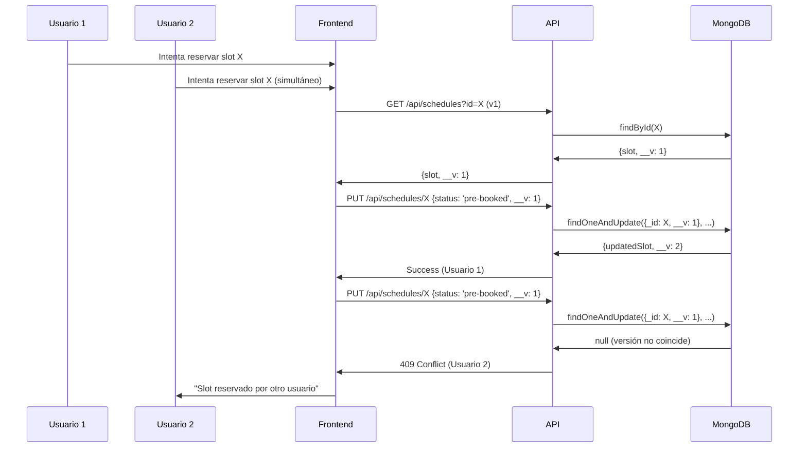

# Sistema de Optimistic Locking para Agenda Slots - Documentación

## Resumen de Implementación

Se ha implementado un sistema completo de **Optimistic Locking** para prevenir condiciones de carrera cuando múltiples usuarios intentan reservar el mismo slot de agenda simultáneamente.

## Componentes Implementados

### 1. Backend - Controller (`schedules.controller.js`)

**Características principales:**
- ✅ **Verificación de versión**: Usa el campo `__v` de Mongoose para verificar versiones
- ✅ **Validación de disponibilidad**: Verifica que el slot esté disponible antes de la reserva
- ✅ **Operaciones atómicas**: Usa `findOneAndUpdate` con query de versión específica
- ✅ **Manejo de errores específicos**: Códigos HTTP 409 para conflictos de concurrencia
- ✅ **Incremento manual de versión**: Control explícito sobre el versionado

**Flujo de actualización:**
1. Obtener documento actual con versión
2. Validar disponibilidad del slot
3. Ejecutar actualización solo si la versión coincide
4. Incrementar versión automáticamente
5. Retornar conflicto si la versión cambió durante la operación

### 2. Frontend - Store (`usePreScheduledSessionsStore.js`)

**Mejoras implementadas:**
- ✅ **Obtención de versión**: Consulta previa para obtener `__v` antes de cada operación
- ✅ **Validación de estado**: Verifica que el slot esté disponible antes de reservar
- ✅ **Manejo de errores**: Propaga errores específicos de concurrencia
- ✅ **Operaciones con versionado**: Incluye `__v` en todas las peticiones de actualización

**Operaciones actualizadas:**
- `addSession`: Obtiene versión antes de reservar slot
- `updateSession`: Maneja cambio de slots con versionado
- `deleteSession`: Libera slots con verificación de versión
- `clearAllSessions`: Limpia todos los slots con control de versión

### 3. Utilidades de Manejo de Errores (`optimisticLocking.js`)

**Funcionalidades principales:**
- ✅ **Clasificación de errores**: Diferencia entre concurrencia, disponibilidad y errores genéricos
- ✅ **Reintentos inteligentes**: Backoff exponencial para errores temporales
- ✅ **Mensajes amigables**: Convierte errores técnicos en mensajes para el usuario
- ✅ **Wrapper de operaciones**: Función `executeSlotOperation` para manejo unificado

**Tipos de errores manejados:**
- **Concurrencia**: Slot modificado por otro usuario
- **Disponibilidad**: Slot ya reservado o no disponible
- **Restricciones de tiempo**: Violación de reglas de separación entre sesiones
- **Genéricos**: Errores de red o servidor

### 4. Frontend - Hook de Formulario (`useSessionForm.js`)

**Integración con Optimistic Locking:**
- ✅ **Uso de utilidades**: Implementa `executeSlotOperation` para operaciones críticas
- ✅ **Manejo de errores**: Usa `handleConcurrencyError` para procesar fallos
- ✅ **Feedback visual**: Toasts específicos según el tipo de error
- ✅ **Recuperación automática**: Sugiere recargar página en caso de conflictos

## Casos de Uso Manejados

### Escenario 1: Reserva Simultánea
**Problema**: Dos usuarios intentan reservar el mismo slot al mismo tiempo

**Solución implementada:**
1. Ambos usuarios obtienen la versión actual del slot
2. El primer usuario actualiza exitosamente (versión incrementa)
3. El segundo usuario recibe error 409 (versión desactualizada)
4. Frontend muestra mensaje: "Este horario ha sido reservado por otro usuario"
5. Sugiere seleccionar otro horario

### Escenario 2: Modificación Durante Edición
**Problema**: Usuario A está editando un slot mientras usuario B lo reserva

**Solución implementada:**
1. Usuario A obtiene versión del slot
2. Usuario B reserva el slot (versión cambia)
3. Usuario A intenta guardar cambios con versión antigua
4. Sistema detecta conflicto y rechaza actualización
5. Frontend notifica del conflicto y sugiere recargar

### Escenario 3: Liberación de Slot Modificado
**Problema**: Intento de liberar un slot que ya fue modificado por otro usuario

**Solución implementada:**
1. Sistema verifica versión antes de liberar
2. Si la versión cambió, maneja el error silenciosamente
3. Continúa con la limpieza local para mantener consistencia de UI
4. Registra error para debugging

## Beneficios del Sistema

### Integridad de Datos
- ✅ **Prevención de double-booking**: Imposible reservar el mismo slot dos veces
- ✅ **Consistencia**: Estado sincronizado entre frontend y backend
- ✅ **Atomicidad**: Operaciones completas o fallidas, sin estados intermedios

### Experiencia de Usuario
- ✅ **Mensajes claros**: Errores específicos en lugar de mensajes genéricos
- ✅ **Sugerencias útiles**: Acciones concretas para resolver conflictos
- ✅ **Recuperación automática**: Reintentos para errores temporales
- ✅ **Feedback inmediato**: Notificaciones en tiempo real

### Escalabilidad
- ✅ **Manejo de concurrencia**: Sistema robusto para múltiples usuarios
- ✅ **Performance optimizada**: Verificaciones mínimas necesarias
- ✅ **Tolerancia a fallos**: Degradación elegante en caso de errores

## Flujo Completo de Operación

## Monitoreo y Debugging

### Logs Implementados
- ✅ **Errores de concurrencia**: Registrados en consola con contexto
- ✅ **Operaciones fallidas**: Detalles específicos del error
- ✅ **Reintentos**: Seguimiento de intentos automáticos

### Métricas Sugeridas
- **Conflictos de concurrencia por minuto**
- **Tasa de éxito de reservas**
- **Tiempo promedio de respuesta de operaciones**

## Consideraciones Futuras

### Optimizaciones Potenciales
- **Cache de slots**: Reducir consultas de verificación
- **WebSockets**: Notificaciones en tiempo real de cambios
- **Batch operations**: Reserva múltiple de slots relacionados

### Monitoreo Avanzado
- **Alertas automáticas**: Para alta tasa de conflictos
- **Dashboard de métricas**: Visualización de operaciones de agenda
- **Análisis de patrones**: Identificación de horarios más demandados

## Conclusión

El sistema de Optimistic Locking implementado proporciona una solución robusta y escalable para el manejo de reservas de agenda, garantizando la integridad de datos mientras mantiene una excelente experiencia de usuario.
